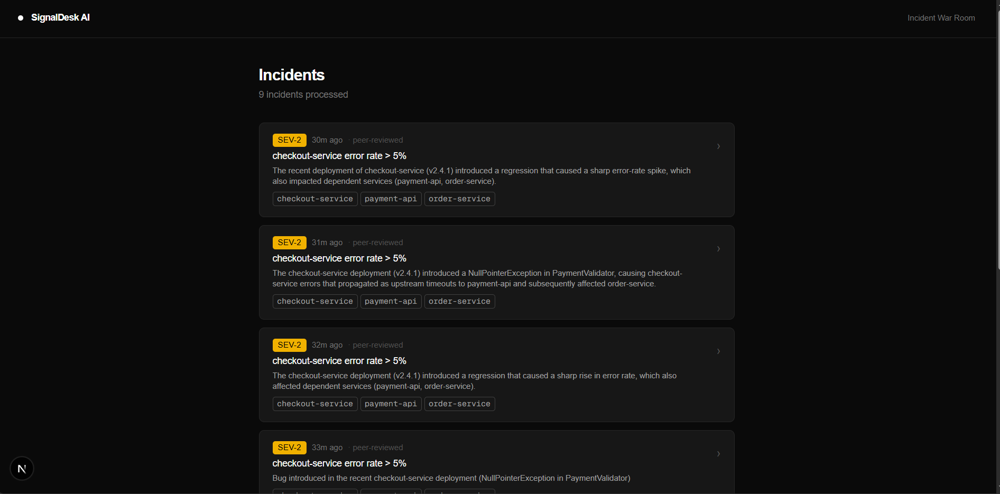
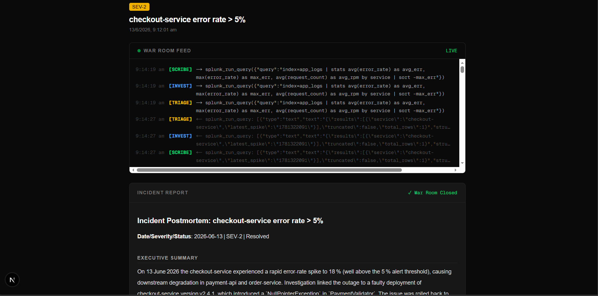
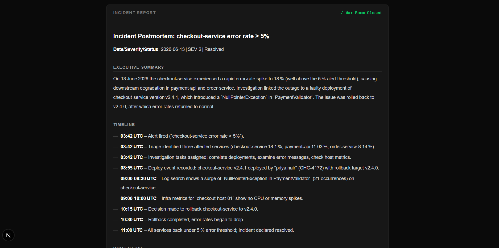
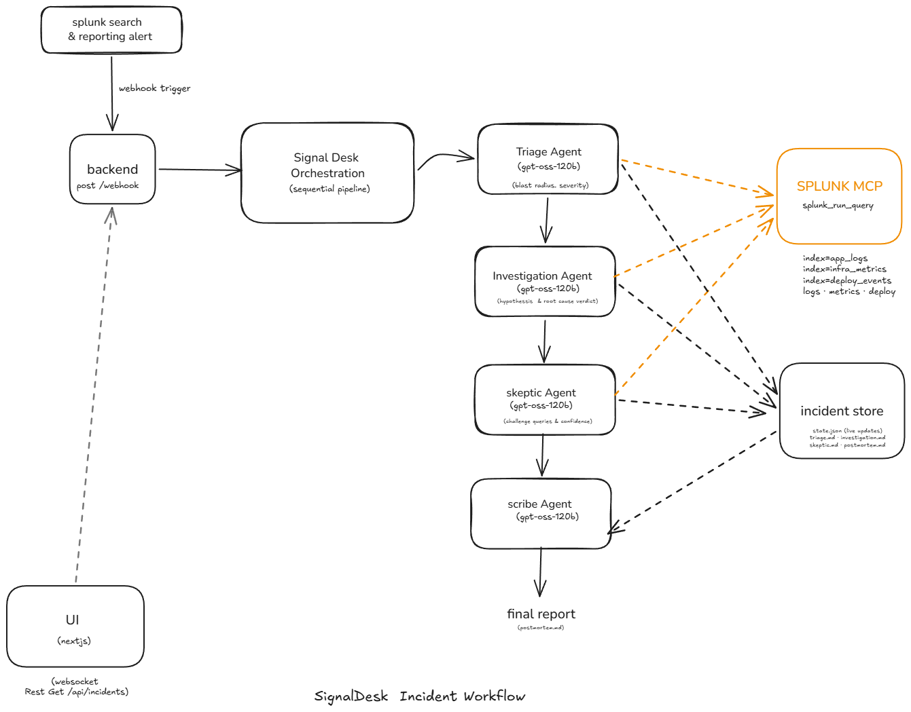

# SignalDesk AI — Multi-Agent Incident War Room

> **When Splunk fires an alert, four AI agents convene instantly: one triages, one investigates, one challenges, one writes the postmortem. You watch them work in real time.**

**📹 [Watch Demo](https://youtu.be/9HiD_ekv5ag)** | **🎓 [Architecture Explainer](https://youtu.be/thiRAU_i20M)** | **🏗️ [Architecture Diagram](./architecture_diagram.png)**



---

## The Problem

When a Splunk alert fires at 2 AM, an on-call engineer faces 15 minutes of manual work before they even understand what's happening:

- Open Splunk, find the alert, understand what triggered it
- Run follow-up SPL queries to determine severity and blast radius
- Form hypotheses, query for evidence, validate or discard each one
- Cross-check findings with a colleague before acting
- Write a postmortem while everything is still fresh

This process is slow, error-prone under pressure, and entirely manual. The cognitive load is highest exactly when the engineer is least available to handle it.

---

## What SignalDesk AI Does

SignalDesk AI turns a Splunk webhook into a fully automated incident war room. The moment an alert fires:

1. **Triage Agent** — classifies severity (SEV-1/2/3) and maps blast radius by querying Splunk for affected services and downstream dependencies
2. **Investigation Agent** — forms hypotheses, runs targeted SPL queries via Splunk MCP to gather evidence, and produces a root-cause verdict with a confidence score
3. **Skeptic Agent** — adversarially challenges the verdict: runs alternative queries to falsify the hypothesis, adjusts confidence, and marks the verdict as peer-reviewed
4. **Scribe Agent** — writes a structured postmortem in Markdown: timeline, root cause, evidence chain, blast radius, and recommended remediation steps

The entire pipeline streams live to a dark-theme web UI via WebSocket — you watch each agent's tool calls and reasoning in real time, then read the completed report when they're done.






---

## Demo & Deployment

- **Demo Video**: [SignalDesk AI — Live Incident War Room Demo | Splunk Agentic Ops Hackathon](https://youtu.be/9HiD_ekv5ag)
- **Explanation**: [How SignalDesk AI Works — 4 Agent Pipeline + Splunk MCP | Architecture Deep Dive](https://youtu.be/thiRAU_i20M)
- **Live Instance**: Run locally — see setup below

---

## Architecture

```
Splunk Enterprise
  │  (saved search alert — cron every minute)
  │  POST /webhook  (via ngrok in local dev)
  ▼
Express Backend (port 3001)
  │
  ▼
SignalDesk Orchestrator
  │
  ├──▶ Triage Agent (gpt-oss-120b)
  │        │── splunk_run_query → main index
  │        └── writes triage.md to incident store
  │
  ├──▶ Investigation Agent (gpt-oss-120b)
  │        │── splunk_run_query × N (hypothesis-driven)
  │        └── writes investigation.md to incident store
  │
  ├──▶ Skeptic Agent (gpt-oss-120b)
  │        │── splunk_run_query (adversarial queries)
  │        └── writes skeptic.md to incident store
  │
  └──▶ Scribe Agent (gpt-oss-120b)
           └── writes postmortem.md to incident store
                    │
                    ▼
              state.json (per-incident)
              (status: in_progress → resolved)
  │
  ├── WebSocket broadcast → Next.js UI (live agent feed)
  └── REST API → Next.js UI (incident list + detail)

Splunk MCP Server (port 8089)
  └── splunk_run_query tool — used by all four agents
```

### How AI Is Used at Runtime

Every agent is a **LangChain ReAct agent** powered by `gpt-oss-120b` (via OpenRouter). Each agent connects to **Splunk's MCP server** via `@langchain/mcp-adapters` (`MultiServerMCPClient`) and calls the `splunk_run_query` tool to query live Splunk indexes during reasoning.

- Triage calls `splunk_run_query` to identify affected services and measure event volume
- Investigation calls `splunk_run_query` repeatedly — forming and testing hypotheses against live data
- Skeptic calls `splunk_run_query` with adversarial queries to falsify or confirm the verdict
- Scribe synthesizes everything into a structured postmortem

No pre-computed answers. Every run queries **live Splunk data** through the **Splunk MCP Server**.

### Tech Stack

| Layer         | Technology                                                        |
| ------------- | ----------------------------------------------------------------- |
| AI Agents     | LangChain `createReactAgent` — 4 specialized agents              |
| LLM           | `gpt-oss-120b` via OpenRouter                                     |
| Splunk AI     | Splunk MCP Server + `@langchain/mcp-adapters` (`MultiServerMCPClient`) |
| Backend       | Express, TypeScript, Bun                                          |
| Real-time UI  | WebSocket (`ws` package) — live agent event feed                  |
| Frontend      | Next.js 15, Tailwind CSS, shadcn/ui                               |
| Incident Store | File-based JSON + Markdown per incident                          |
| Trigger       | Splunk saved search → webhook → ngrok (local dev)                 |

---

## Project Structure

```
signaldesk-ai/
├── backend/
│   └── src/
│       ├── server.ts              # Express + WebSocket server (port 3001)
│       ├── types.ts               # Shared WarRoomState types
│       ├── agents/
│       │   ├── orchestrator.ts    # Sequential pipeline: Triage→Investigation→Skeptic→Scribe
│       │   ├── triage.ts          # SEV classification + blast radius agent
│       │   ├── investigation.ts   # Hypothesis-driven root cause agent
│       │   ├── skeptic.ts         # Adversarial peer-review agent
│       │   └── scribe.ts          # Postmortem writing agent
│       ├── lib/
│       │   ├── eventBus.ts        # Node EventEmitter — broadcasts agent events to WebSocket
│       │   ├── fileTools.ts       # Incident directory + file write tools
│       │   ├── model.ts           # LLM factory (OpenRouter)
│       │   └── splunkSchema.ts    # Splunk index metadata for agent context
│       └── splunk/
│           └── mcp.ts             # MultiServerMCPClient → Splunk MCP Server
├── frontend/
│   └── src/
│       ├── app/
│       │   ├── page.tsx           # Incident list (auto-refreshes every 5s)
│       │   └── incidents/[id]/
│       │       └── page.tsx       # Incident detail: live feed + postmortem
│       ├── components/
│       │   ├── WarRoomLive.tsx    # WebSocket client — live agent event stream
│       │   └── IncidentPoller.tsx # Client-side router.refresh() poller
│       └── lib/
│           └── types.ts           # Frontend incident types
├── incidents/                     # Per-incident directories (gitignored)
│   └── <incident-id>/
│       ├── state.json             # Live incident state + status
│       ├── triage.md
│       ├── investigation.md
│       ├── skeptic.md
│       └── postmortem.md
├── architecture_diagram.png       # Architecture diagram
└── LICENSE                        # MIT
```

---

## Getting Started

> **Full Splunk setup (indexes, HEC, MCP Server install, `delete_by_keyword` capability, saved search alert + webhook values) is documented in [SPLUNK_SETUP.md](./SPLUNK_SETUP.md).**

### Prerequisites

- **Splunk Enterprise** (local install, port 8089 + 8000)
- **Splunk MCP Server app** — install from [Splunkbase (App ID 7931)](https://splunkbase.splunk.com/app/7931) if not present, then enable under Settings → Server Settings → MCP Server
- **ngrok** (for local webhook delivery from Splunk)
- **Bun** v1.0+ or Node.js 18+
- **OpenRouter API key** (or any OpenAI-compatible endpoint)

### Environment Variables

Copy the example files and fill in your values:

```bash
cp backend/.env.example backend/.env
cp frontend/.env.example frontend/.env.local
```

**`backend/.env`** (see [`backend/.env.example`](./backend/.env.example)):

```env
PORT=3001

# LLM — OpenRouter API key (https://openrouter.ai)
OPENROUTER_API_KEY=sk-or-v1-xxxxxxxx...
# WARROOM_MODEL=openai/gpt-oss-120b:free   # override model if needed

# Splunk MCP Server (enable in Splunk: Settings → Server Settings → MCP Server)
SPLUNK_MCP_ENDPOINT=https://localhost:8089/services/mcp
SPLUNK_MCP_TOKEN=your_splunk_mcp_token_here

# Splunk HEC — only needed to run the seed script
SPLUNK_HEC_URL=http://localhost:8088/services/collector/event
SPLUNK_HEC_TOKEN=your_hec_token_here
```

**`frontend/.env.local`** (see [`frontend/.env.example`](./frontend/.env.example)):

```env
NEXT_PUBLIC_API_URL=http://localhost:3001
```

### Installation

```bash
# Clone the repo
git clone https://github.com/rushibhosalepro/signaldesk-ai.git
cd signaldesk-ai

# Install backend dependencies
cd backend && bun install

# Install frontend dependencies
cd ../frontend && bun install
```

### Run Locally

```bash
# Terminal 1 — Backend
cd backend
bun run start          # use 'start', not --watch (avoids restart on incident writes)

# Terminal 2 — Frontend
cd frontend
bun run dev            # http://localhost:3000

# Terminal 3 — ngrok tunnel (for Splunk webhook delivery)
ngrok http 3001
```

Copy the ngrok HTTPS URL (e.g. `https://abc.ngrok-free.app`) — use this as the webhook URL in your Splunk saved search alert.

### Splunk Alert Setup

1. In Splunk, create a **Saved Search** with your query (any non-empty result triggers the alert)
2. Add an **Alert Action → Webhook** with URL: `https://<your-ngrok-url>/webhook`
3. Set **Trigger condition**: Per-result or Number of results > 0
4. Set **Schedule**: `* * * * *` (every minute for demo), throttle to 1 minute
5. Save and wait — or manually trigger the search to fire it immediately

Once the webhook fires, open `http://localhost:3000` — the incident appears with `● live` status. Click it to watch the agents reason in real time.

### Seed Sample Data (optional demo)

```bash
cd backend
bun run src/seed.ts    # injects sample events into Splunk for demo purposes
```

---

## What Was Built During the Hackathon

This project was started on **May 18, 2026** (hackathon submission period open date) and built entirely during the hackathon period.

Key capabilities built:

- **4-agent sequential pipeline** with distinct system prompts, tools, and responsibilities (Triage → Investigation → Skeptic → Scribe)
- **Live Splunk MCP integration** — all agents query live Splunk data at runtime via `MultiServerMCPClient` and the Splunk MCP Server
- **Real-time WebSocket agent feed** — tool calls and reasoning stream to the UI as they happen, with per-agent color coding and pipeline progress tracker
- **Tool call transparency** — every `splunk_run_query` call is intercepted and streamed to the UI with input and result previews
- **Adversarial peer review** — the Skeptic agent actively tries to falsify the Investigation verdict before the Scribe writes it up
- **Structured incident store** — each incident gets its own directory with per-agent Markdown files and a live-updating `state.json`

---

## How Splunk AI Capabilities Are Used

| Capability | How Used |
|---|---|
| **Splunk MCP Server** | All 4 agents connect via `MultiServerMCPClient` and call `splunk_run_query` as a LangChain tool — querying `main`, `_internal`, and `summary` indexes at runtime |
| **Splunk Saved Search Alerts** | Trigger the war room automatically when a search condition fires — the webhook payload includes the triggering result row used to seed each agent's context |
| **Live Splunk Data** | No pre-computed or mocked answers. Every hypothesis is validated against live events in Splunk indexes |

---

## License

MIT License — see [LICENSE](./LICENSE)

---

## Built for

[Splunk Agentic Ops Hackathon](https://splunk.devpost.com/?ref_feature=challenge&ref_medium=your-open-hackathons&ref_content=Submissions+open&_gl=1*1h1d0m4*_gcl_au*MTQ4OTk5Mzk1My4xNzgwOTI2NTQ1*_ga*MTE4NDMxNzcyNC4xNzgwOTI2NTQ1*_ga_0YHJK3Y10M*czE3ODEzMjQ0MDYkbzMyJGcxJHQxNzgxMzI1MjQ2JGo2MCRsMCRoMA..) — Observability Track
